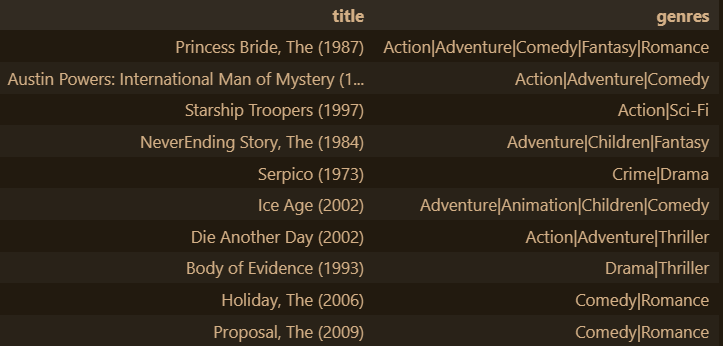

<h1 align="center">Neural Network Movie Recommendation Software</h1>

# Contents:

 1. [Project Overview](https://github.com/PJRyn/Movie-Recommendation-NN#project-overview)
 2. [About DataSet](https://github.com/PJRyn/Movie-Recommendation-NN#about-dataset)
 3. [Extracting, Transforming and Loading process](https://github.com/PJRyn/Movie-Recommendation-NN#extracting-transforming-and-loading-process-etl)
 4. [Neural Network](https://github.com/PJRyn/Movie-Recommendation-NN#Neural-Network)
 5. [References](https://github.com/PJRyn/Movie-Recommendation-NN#References)


# Project Overview

This was one of my final projects for the Monash University data analysis bootcamp in 2022. For this project we were tasked to find a data set, use an ETL (Extract, Transform, Load,) pipeline using an SQL database and then create a neural network using that data. This was a group task, but I have compiled all the elements I had worked on in the project here. Then we needed to find ways to improve our neural network. For this task I had decided to use the MovieLens database with 100836 user reviews to create and provide a movie recommendation software similar to Goodreads, where a pre-existing user is recommended movies based upon their own reviews. To do this I downloaded the data, used an ETL pipeline to bring the data into a PostgreSQL database, then from the database I created training data and used Keras to create a neural network to provide recommendations. The KNN means the recommendations can use genre, user, movie, rating, popularity to provide the recommendations.

# About DataSet

In this Project I had used the [Movie Lens](https://movielens.org/) dataset. MovieLens is a rating database that lets users give ratings on movies and also the genres of each movie and its average rating. I used the dataset that can be found [here](https://www.kaggle.com/datasets/shubhammehta21/movie-lens-small-latest-dataset). From 2018, so it is a bit dated now but contains a very good dataset of 100836 reviews from 610 users with a total 9724 movies.

# Extracting, Transforming and Loading process (ETL)

The extract step was to download the dataset, luckily it was just a .csv file. Then we had to transform the data, lukcily the data was needed very little done to it From the initail .csv file. So wanted to verify it was usable for the project. To begin I had checked for any null values and checked the variables had matched the ones we had needed. The data had matched and was ready to be loaded into a SQL database. I had created one using the ```queries.sql``` file to make the needed tables and join them. Then the data could be loaded in using pandas in the ```data_etl.ipynb```. Where the tables for the movies and ratings could be combined. Or they can be combine in pgAdmin.

# Neural Network

The neural network model is located in the ```movie_recommendation_using_NN.ipynb``` folder. The aim was to use collaborative filtering similar to that of the Kears model provided in their documentation [2]. As well as the model written about in “Neural Collaborative Filtering” [1] . Where users are recommended content based upon similar users preferences, as well as their own preferences. 

To run this file simply open “movie_recommendation_using_NN.ipynb” and run all cells (assuming all dependencies are correctly installed). This process may take some time as there are multiple iterations of the neural collaborative filtering model (NCF).

The program loads in the data from the SQL database, then it cleans the data by creating a dataframe of only needed columns and prepares the data by enumerating it so it indexes at 0 for the machine learning model. As well as creating x and y variables, creating training and testing data and splitting the data. Then a sequential Keras model is built, that is optimized through 4 iterations, then the model visualizes a dataframe of the 10 movie recommendations for the user based on the user_id provided.

Here is an example of movie recommendations for user 314:



[1] "Neural Collaborative Filtering", acessed on the 18th Juanuary 2023. (https://arxiv.org/abs/1708.05031)

[2] "Collaborative Filtering for Movie Recommendations", acessed on the 17th Juanuary 2023 (https://keras.io/examples/structured_data/collaborative_filtering_movielens/)

# References

* [Convolutional Neural Networks for Visual Recognition](http://cs231n.stanford.edu/)
* [Keras documentation for the VGG19 Model](https://keras.io/api/applications/vgg/#vgg19-function)
* [Keras documentation for the Xception model](https://keras.io/applications/#xception)
* [Pyspark documentation](https://spark.apache.org/docs/latest/api/python/)